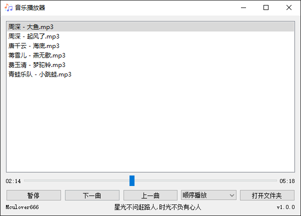

# 项目

一个基于PyQt5实现的简易音乐播放器。

# 功能

- 添加本地音乐文件夹
- 记忆用户打开的文件夹路径，下次自动加载
- 播放/暂停
- 上一曲/下一曲
- 双击列表中的歌曲播放
- 进度条实时刷新和播放控制

# 效果图

# 教程

- [pyqt5实现一个简易音乐播放器](https://mculover666.blog.csdn.net/article/details/116424865)

